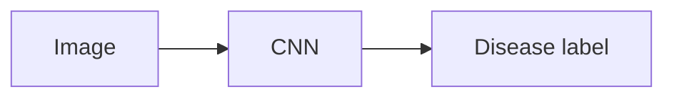
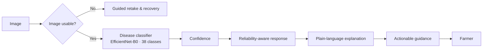
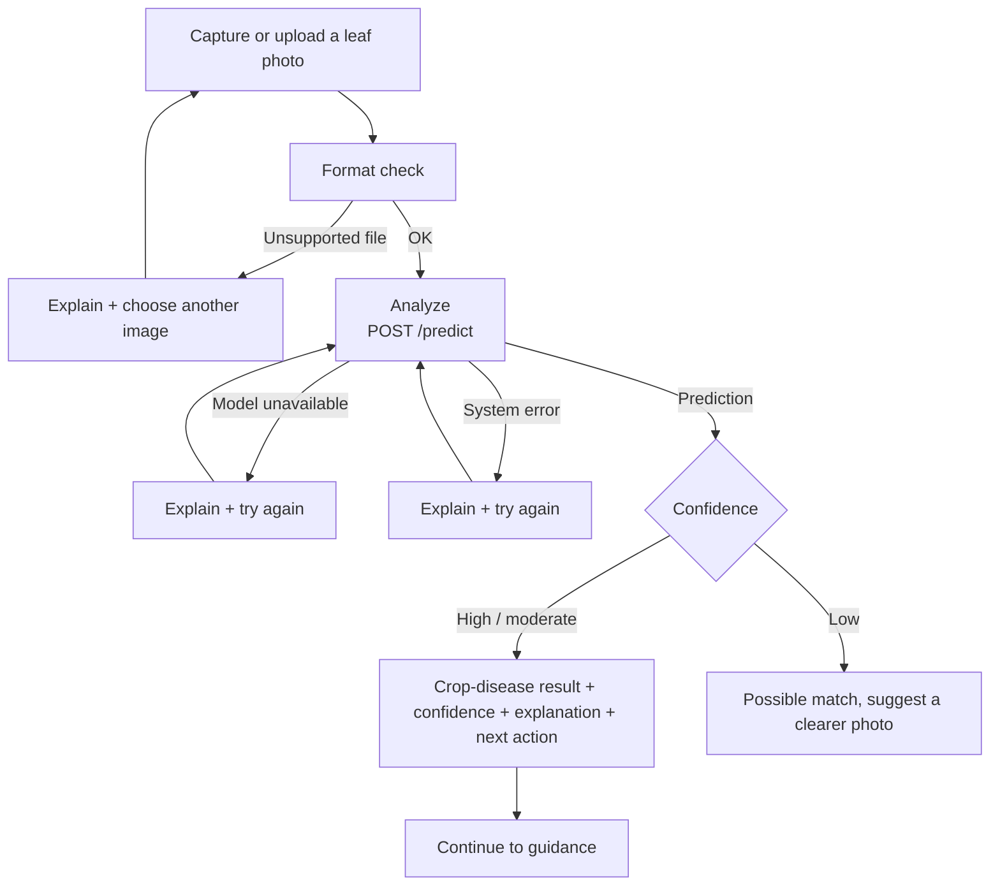
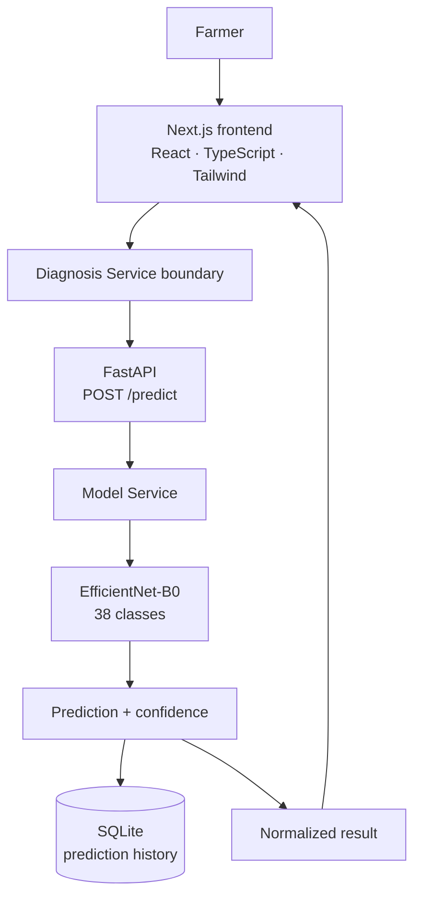

<div align="center">

# 🌱 AgriSmart AI

**Intelligent Agriculture for a Sustainable Future**

*A farmer-first computer-vision system.*

[](https://github.com/DhairyaChangela/AgriSmart-AI/releases)
[](LICENSE)
[](requirements.txt)
[](https://github.com/DhairyaChangela/AgriSmart-AI/stargazers)
[](frontend)
[](app/backend/main.py)
[](model/architectures/classifier.py)
[](model/labels/classes.json)
[](#project-status--roadmap)

> *"Complex technology behind the scenes. Simple decisions in front of the farmer."*


[Why](#why-agrismart-ai) · [How it works](#how-it-works) · [Features](#key-features) · [Capture](#-capture-the-right-photo) · [Farmer experience](#farmer-experience) · [AgriBot](#-agribot) · [Architecture](#architecture) · [Machine learning](#machine-learning) · [API](#api) · [Installation](#installation) · [Repository](#repository-structure) · [Status & Roadmap](#project-status--roadmap) · [Contributing](#contributing) · [License](#license)

</div>

---

## What is this?

AgriSmart AI turns a photo of a possibly-sick plant into **decision support**, not just a class label:

> **photo → possible disease → confidence → explanation → next action**

It is more than a classifier — it is a farmer-facing **crop-health decision-support experience**: a mobile-first user journey wrapped around a real computer-vision pipeline, with honest uncertainty and recoverable error states throughout.

---

## Why AgriSmart AI?

A farmer spots a sick plant and has an urgent, practical question: *what is wrong, and what do I do today?* Expert help is often far away, slow, or expensive — while the disease keeps spreading.

AgriSmart closes that gap with the device already in the farmer's pocket.

A basic classifier stops at an image → class mapping:



AgriSmart does more:



Every stage is honest: the system never presents machine output as certainty, never hides low confidence, and never leaves the farmer at a dead end.

---

## How it works

One continuous journey — capture, check, analyze, understand, act — with a recovery path at every step:



---

## Key features

### Capture
- Camera capture **and** gallery upload
- Review-before-analyze flow — nothing is sent until the farmer confirms
- Mobile-first, large touch targets, readable in daylight conditions

### AI diagnosis
- **EfficientNet-B0** (PyTorch), 38 crop/disease classes
- 224×224 images, ImageNet normalization, server-side preprocessing
- **Confidence-aware results** — every prediction carries a 0–1 confidence score that drives the UI language (high / moderate / low)

### Farmer guidance
- Plain-language result: what was seen, how sure the system is, what it means, what to do next
- Actionable next steps without pesticide names, dosages, or treatment claims
- Recoverable failure states instead of dead ends

### AgriBot
- Contextual assistant: oriented to each screen, guides better photos, explains results, helps recover from errors
- **Never independently diagnoses** — diagnosis always comes from the ML pipeline

---

## Farmer experience

Design rules behind every screen:

- **One clear action per screen**, never a wall of choices
- **Plain language** — no jargon, no raw ML terminology
- **Honest uncertainty** — confidence is a first-class citizen, never disguised certainty
- **Recoverable errors** — a poor photo, an unavailable model, or a failed analysis each get their own clear next step
- **Respect for the user** — no accounts required, photos stay on the device until analysis starts

Technical ML details never leak into the farmer-facing experience.

---

## 📸 Capture the Right Photo

A good photo is the whole game: clear, close, and well-lit leaves let the model work on the details that matter. Match the pattern in the reference below — framing, distance, light — and the analysis starts with its best chance.

<div align="center">


</div>

- **Get close** — fill the frame with the leaf; one clear leaf beats a wide shot.
- **Go for even light** — daylight or soft shade; avoid harsh glare and heavy shadows.
- **Keep it focused** — steady hands, a still leaf, and the affected part in crisp detail.
- **Simplify the background** — plain, low-contrast surroundings keep the leaf the main subject.

---

## 🤖 AgriBot

AgriBot is the farmer's companion: a **guide, not the product itself**. It stays in context on every screen and never stands in for the model.

<div align="center">

<br>
<sub>*Illustrative identity asset — not a live screenshot.*</sub>

</div>

What AgriBot does:

- **contextual navigation** — orients the farmer to the current screen and what to do next,
- **capture guidance** — suggests framing, light, and focus for a better leaf photo,
- **result explanation** — walks through the diagnosis in plain language,
- **error recovery** — helps retry without losing the photo or the flow,
- **never independently diagnoses** — diagnosis always comes from the AI pipeline through the diagnosis service.

---

## Architecture

Clean boundaries keep frontend, backend, and model independently testable:



- **Frontend** owns capture, display, and guidance — never model logic.
- **Diagnosis Service** is the single abstraction the UI talks to; the real HTTP client lives behind it.
- **Backend API** owns upload validation, orchestration, persistence, and the `/predict` contract.
- **Model** owns pixels → prediction + confidence, returning a confidence value with every result.

---

## Machine learning

| Component          | Current implementation                                          |
| ------------------ | --------------------------------------------------------------- |
| Model              | EfficientNet-B0 (`model/architectures/classifier.py`)           |
| Framework          | PyTorch                                                         |
| Classes            | 38 crop/disease classes (`model/labels/classes.json`)           |
| Dataset family     | PlantVillage-style                                              |
| Input size         | 224×224                                                         |
| Normalization      | ImageNet mean/std                                               |
| Train / eval / predict | `model/train.py` · `model/evaluate.py` · `model/predict.py` |

**Evaluation honesty.** The repository does **not** publish accuracy, F1, or benchmark numbers — none are claimed anywhere. Final results will be produced only against the **organizer-provided held-out test set**, reporting accuracy, macro F1, per-class performance, out-of-distribution behavior, and reproducibility.

> Trained weights (`*.pth` / `model/checkpoints/`) are deliberately **not committed**. Until a trained checkpoint is present, `/predict` honestly returns `model_not_ready` instead of pretending to classify.

---

## API

Base URL (development): `http://localhost:8000`

| Method | Path       | Description                                        |
| ------ | ---------- | -------------------------------------------------- |
| GET    | `/health`  | Service health — `{"status": "healthy"}`           |
| POST   | `/predict` | Upload an image, run inference, return prediction  |
| GET    | `/history` | Latest 20 saved predictions (SQLite, newest first) |

### POST /predict

Multipart form upload, field name **`file`**. Accepted types: `image/jpeg`, `image/jpg`, `image/png`, `image/webp`.

```bash
curl -X POST http://localhost:8000/predict \
  -F "file=@leaf.jpg"
```

**Example success response:**

```json
{
  "status": "success",
  "class": "Tomato___Early_blight",
  "crop": "Tomato",
  "disease": "Early_blight",
  "confidence": 0.9998,
  "confidence_percent": 99.98
}
```

**Model not ready** (no trained checkpoint present) — still HTTP 200, clearly labelled:

```json
{
  "status": "model_not_ready",
  "message": "The trained model is not available yet."
}
```

**Error responses:**

| Status | Meaning                                                     |
| ------ | ----------------------------------------------------------- |
| `400`  | Unsupported file type, or file is not a readable image      |
| `422`  | Request missing the required `file` field                   |
| `500`  | Unexpected server/model failure processing the image        |

Successful predictions are persisted to SQLite and surfaced through `GET /history`.

---

## Repository structure

```
AgriSmart-AI/
├── app/backend/        # FastAPI: main app, /predict, /history, services, DB
├── frontend/           # Next.js + React + TypeScript + Tailwind journey
├── model/              # EfficientNet-B0: architecture, train, predict, evaluate, preprocessing, classes
├── data/               # Dataset layout & metadata (large data never committed)
├── docs/               # Architecture + product docs
├── scripts/            # Tooling (e.g. dataset download)
├── tests/              # Future home of automated checks
├── .github/            # Community health files
├── .env.example        # Environment template (backend + frontend base URLs)
├── requirements.txt    # Pinned Python dependencies
├── CONTRIBUTING.md
└── LICENSE             # MIT
```

---

## Installation

```bash
git clone https://github.com/DhairyaChangela/AgriSmart-AI.git
cd AgriSmart-AI
```

**Backend** (from the repository root):

```bash
python -m venv .venv
# Windows: .venv\Scripts\Activate.ps1  ·  macOS/Linux: source .venv/bin/activate
pip install -r requirements.txt
cp .env.example .env
```

**Frontend:**

```bash
cd frontend
npm install
```

The frontend reads `NEXT_PUBLIC_API_BASE_URL` for the API (defaults to `http://localhost:8000`, matching `.env.example`). No extra `.env` is required to run everything locally.

---

## Usage

1. **Start the backend** (repo root):
   ```bash
   uvicorn app.backend.main:app --reload
   ```
2. **Start the frontend** (from `frontend/`):
   ```bash
   npm run dev
   ```
3. Open **http://localhost:3000** → **Check your crop**.
4. Capture or upload a leaf photo → review → *Check this leaf*.
5. Read the result: condition, confidence, explanation, and next action.

**Build & lint** (from `frontend/`):

```bash
npm run lint              # eslint
npx next build --webpack  # production build (verified in this environment)
```

> Environment note: on this Windows setup the default Turbopack build (`npm run build`) currently hits a pre-existing CSS `@import` ordering issue in `src/app/globals.css`; the verified build path is `npx next build --webpack`. `npm run dev` is unaffected.

**Direct API smoke test:**

```bash
curl -s http://localhost:8000/health
curl -s -X POST http://localhost:8000/predict -F "file=@leaf.jpg"
```

---

## Reliability & edge cases

| Situation                    | Implemented behavior                                                  |
| ---------------------------- | -------------------------------------------------------------------- |
| Unsupported file type        | Blocked client-side before upload; backend returns `400` if it slips through |
| Unreadable / corrupt image   | Backend returns `400` "not a valid image"                            |
| Model unavailable            | `/predict` returns `model_not_ready` → UI shows a clear "try again" state |
| Failed analysis (5xx / network) | Degrades to the analysis-failed recovery screen — never a dead end   |
| Uncertain prediction         | Result is labelled by confidence; low confidence suggests a clearer photo |
| Out-of-vocabulary crops      | Predictions are limited to the 38 trained classes; results outside production confidence are flagged honestly |

No automatic blur/lighting detection is claimed — a poor photo is handled through guided recapture and honestly framed results, not through a pretend quality classifier.

---

## Evaluation philosophy

This project deliberately refuses to fabricate numbers:

- No self-reported accuracy, F1, or latency benchmarks are asserted.
- Robustness cannot be proven from a curated demo set.
- Final results will be produced only against the **official held-out test set**, reporting:
  - overall accuracy and **macro F1**,
  - **per-class** performance,
  - **out-of-distribution** behavior and failure modes,
  - **reproducibility** (seed, configs, environment).

Until then, every screen the farmer sees behaves as a responsible product should: uncertainty exposed, errors recoverable.

---

## Project status & roadmap

| Area                        | Status                                                     |
| --------------------------- | ---------------------------------------------------------- |
| Frontend farmer journey     | Live — capture → quality → analysis → result → edge handling |
| Backend API                 | Live — `/predict`, `/health`, `/history`, SQLite history   |
| Frontend ↔ API integration  | Live — verified end-to-end against real `/predict`         |
| ML model code               | Live — EfficientNet-B0 38-class train/predict/evaluate     |
| Live inference              | Requires a trained checkpoint (`model/checkpoints/`) — `model_not_ready` until provided |
| Evaluation                  | Pending — held-out set, official protocol                  |
| Out-of-distribution claims  | Not claimed                                                |
| Automated tests             | Planned — `tests/` is their future home                    |

**Current priority.** The core disease-detection product: a reliable, honest pipeline from photo to actionable guidance.

**Looking ahead.** Weather and irrigation advisory, sustainability signals, multilingual guidance, expert escalation, and broader crop-health intelligence built on the same reliable base.

---

## Contributing

See [CONTRIBUTING.md](CONTRIBUTING.md) for the guide (issues, branch rules, code style, no-image-edits-by-AI rule).

Quick summary:
- Fork, branch, small focused PRs, descriptive commit messages.
- Tests live under `tests/` and model experiments under `model/`.
- No large files, secrets, or model weights in the repository.

---

## License

Distributed under the **MIT License**. See [LICENSE](LICENSE) for details. Copyright (c) 2026 AgriSmart AI contributors.

---

<div align="center">

**🌱 One photo at a time — AgriSmart AI**

Complex technology behind the scenes. Simple decisions in front of the farmer.

</div>