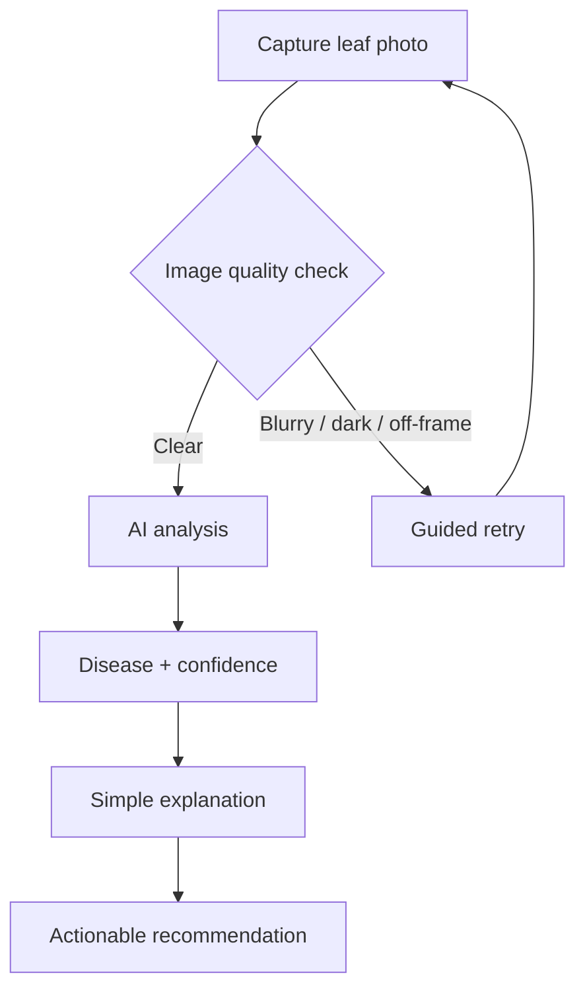
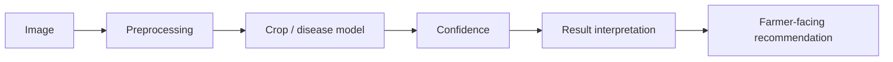
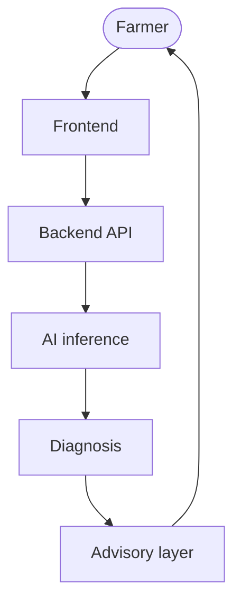

# AgriSmart AI

> Identify crop diseases from a photo. Understand the problem. Take the next step.

[](LICENSE)
[](#project-status)
[](CONTRIBUTING.md)

AI-powered crop health intelligence for farmers — simple interaction, sophisticated technology, farmer-first experience.

**Start here:** [How it works](#how-it-works) · [Architecture](#architecture) · [Documentation](#documentation) · [Project status](#project-status) · [Contributing](CONTRIBUTING.md)

---

## Why AgriSmart AI?

A farmer spots a sick plant and faces an urgent, practical question: *what is wrong, and what do I do today?* Expert help is often far away, slow, or expensive — while the disease keeps spreading.

AgriSmart AI closes that gap with the device already in the farmer's pocket: photograph the affected leaf, get a plain-language explanation of the likely problem, and receive one or two practical next steps.

No jargon. No guesswork presented as certainty. No account needed to start.

## The Idea

Capture a crop image. Understand what is affecting it. Receive a simple explanation. Know what to do next.

The product philosophy is three lines long:

- **Simple interaction.** One clear action per screen.
- **Sophisticated technology.** Validation, confidence, and fallbacks handled quietly.
- **Farmer-first experience.** Built for daylight, dusty lenses, and patchy connectivity.

## How It Works

The intended farmer journey, end to end:



Each stage has a recovery path. A poor photo gets guidance, not rejection. An uncertain prediction is labelled uncertain, never disguised as fact.

## Product Experience

Designed for minimal technical knowledge and mobile-first usage:

- **Capture:** photograph or upload a leaf; instant feedback on blur, lighting, and framing.
- **Feedback:** every state — checking, analyzing, failed, uncertain — is communicated in plain words.
- **Results:** what was seen, how confident the system is, what it means, what to do.
- **Guidance:** practical next steps plus a clear signal for when to consult an agronomist.

Details: [Product concept](docs/product/).

## AgriBot

AgriBot is the product's contextual assistant — **a guide, not the product itself**.

It helps the farmer:

- understand what to do on each screen,
- understand results once they arrive,
- recover from errors (poor photo, failed analysis, low confidence),
- navigate the experience without getting lost.

AgriBot explains and reassures. Diagnosis always comes from the AI pipeline through the advisory layer — never from the assistant alone.

## AI Pipeline

The intended flow from pixels to practical advice:



| Stage                   | Status    |
| ----------------------- | --------- |
| Image capture & quality | Current*  |
| Preprocessing           | Planned   |
| Crop / disease model    | Planned   |
| Confidence scoring      | Planned   |
| Result interpretation   | Planned   |
| Farmer recommendations  | Planned   |

\* *Current* means the concept and contracts are defined in this repository — no model code exists yet.

## Architecture

Clean separation keeps the frontend, backend, and model independently testable:



- **Frontend** owns capture, display, and guidance — never model logic.
- **Backend API** owns validation, orchestration, and advisory wording.
- **AI inference** owns predictions and returns confidence with every result.

Details: [Architecture](docs/architecture/).

## Core Features

### Core

- Crop/leaf image capture and upload
- Image validation with guided retry
- Disease detection with confidence
- Simple visual explanation
- Actionable, plain-language guidance
- Contextual AgriBot assistance

### Future / Optional

- Weather-aware advice
- Irrigation scheduling
- Sustainability insights
- Crop recommendations
- IoT integrations

Future items are tracked in the [roadmap](#roadmap). None are claimed as built.

## Robustness

Real fields are messy, so every failure mode is designed, not improvised:

| Situation              | Intended behavior                                      |
| ---------------------- | ------------------------------------------------------ |
| Blurry image           | Explain the blur, guide a retake                       |
| Poor lighting          | Suggest daylight / angle, allow retry                  |
| Non-leaf image         | Say so plainly, ask for a leaf photo                   |
| Unsupported crop       | State the limitation, suggest alternatives             |
| Uncertain prediction   | Show low confidence, recommend retake or expert review |
| Failed analysis        | Apologize briefly, offer retry — never a dead end      |

## Model Evaluation

Final evaluation metrics will be reported after the official test set is evaluated.

- Scoring runs against the organizer-provided held-out test set.
- No accuracy, precision, or recall numbers are claimed anywhere in this repository before that evaluation.
- Evaluation scripts (when added under `tests/`) will validate metric computation — never fabricate results.

## Technology

Honest stack: everything below is a selected direction, marked as such. Nothing here implies shipped code.

| Area     | Choice                        | Status   |
| -------- | ----------------------------- | -------- |
| App      | TypeScript web app, mobile-first | Proposed |
| Backend  | Python API service            | Proposed |
| ML       | Python, PyTorch               | Proposed |
| Evaluation | Organizer held-out test set | Planned  |

## Repository Structure

```
AgriSmart-AI/
├── README.md
├── LICENSE
├── .gitignore
├── .env.example
├── CONTRIBUTING.md
├── docs/
│   ├── README.md
│   ├── architecture/
│   │   └── README.md
│   ├── product/
│   │   └── README.md
│   └── assets/
│       └── README.md
├── app/
│   └── README.md
├── model/
│   └── README.md
├── data/
│   └── README.md
├── tests/
│   └── README.md
└── .github/
    ├── README.md
    └── pull_request_template.md
```

Each folder's README explains its purpose and current status. No placeholder code lives anywhere in this tree.

## Getting Started

This repository is currently a foundation — definitions and documentation, no runnable code yet. The only valid setup today:

```bash
git clone https://github.com/dax72029-star/AgriSmart-AI.git
cd AgriSmart-AI
```

Prerequisites: Git and a text editor. When runnable components land, this section will grow real, tested commands — nothing here is aspirational.

Copy `.env.example` to `.env` once services exist. Never commit `.env`.

## Documentation

- [Documentation index](docs/)
- [Architecture](docs/architecture/)
- [Product concept](docs/product/)
- [Assets](docs/assets/)
- [App layer](app/)
- [Model pipeline](model/)
- [Datasets](data/)
- [Tests](tests/)

## Project Status

🚧 Active development — repository foundation phase.

| Area                   | Status   |
| ---------------------- | -------- |
| Repository foundation  | Complete |
| Product definition     | Complete |
| Frontend               | Planned  |
| Backend                | Planned  |
| ML pipeline            | Planned  |
| Evaluation             | Planned  |

## Roadmap

| Phase              | Focus                                              | Status     |
| ------------------ | -------------------------------------------------- | ---------- |
| 01 — Foundation    | Repository, identity, docs, contracts              | Complete   |
| 02 — Product Experience | Capture flow, quality feedback, results display | Planned    |
| 03 — AI Pipeline   | Training, inference, confidence                    | Planned    |
| 04 — Integration   | App ↔ API ↔ model wired end to end                | Planned    |
| 05 — Evaluation    | Held-out test scoring and reporting                | Planned    |
| 06 — Final Polish  | Hardening, accessibility pass, demo readiness      | Planned    |

## Team

| Role | Member |
| ---- | ------ |
| —    | *To be added — name, role, GitHub handle* |

## License

MIT — see [LICENSE](LICENSE).
