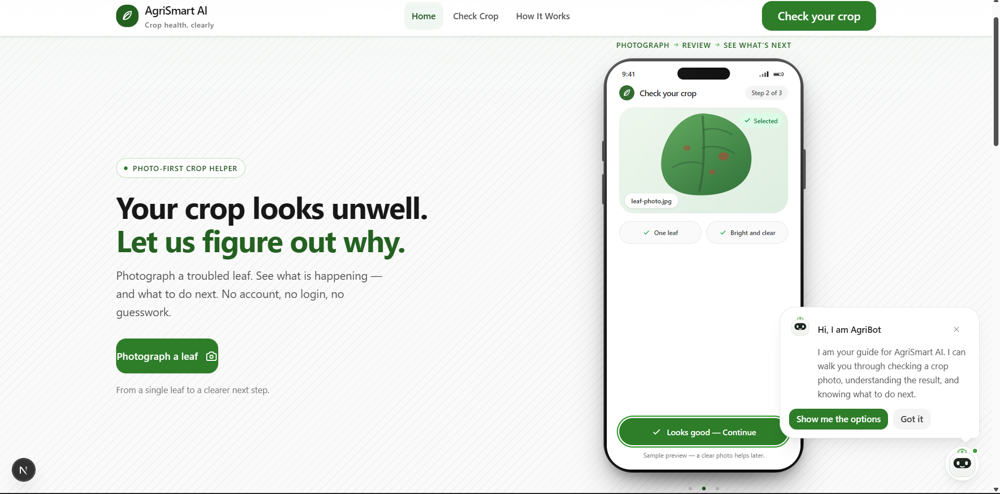
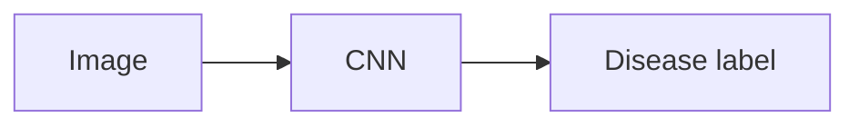
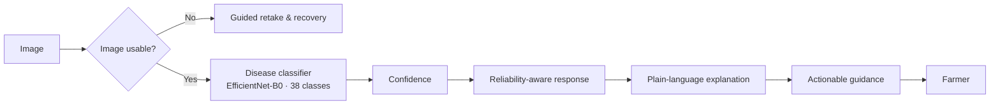
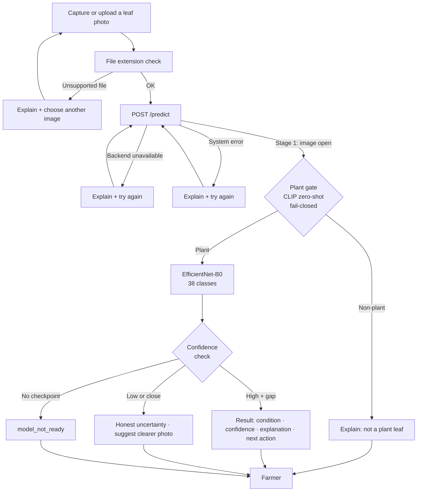
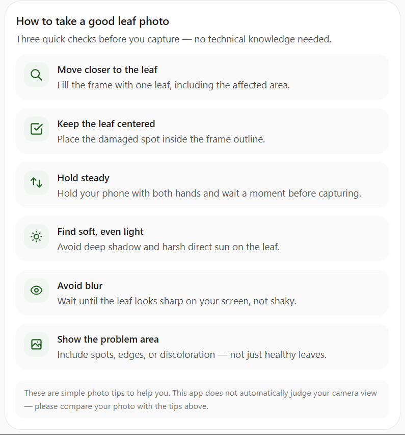
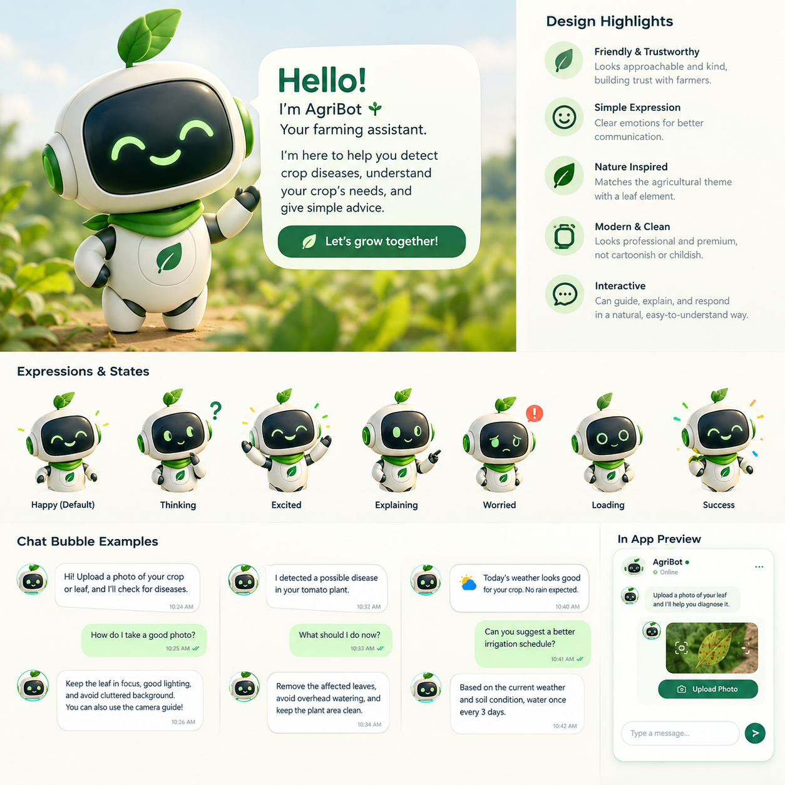
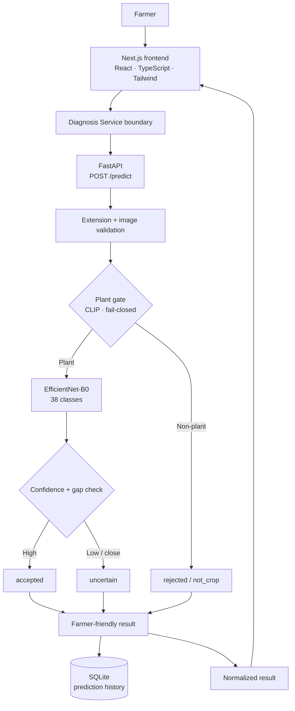

<div align="center">

# 🌱 AgriSmart AI

**Intelligent Agriculture for a Sustainable Future**

*A farmer-first computer-vision system.*

> 📄 **[One-Page Model Report](report/model_report.md)** — one page, source-verified: 38-class EfficientNet-B0, PlantVillage validation, per-class scores, confusion matrix, robustness diagnostics.

[](https://github.com/DhairyaChangela/AgriSmart-AI/releases)
[](LICENSE)
[](requirements.txt)
[](https://github.com/DhairyaChangela/AgriSmart-AI/stargazers)
[](frontend)
[](app/backend/main.py)
[](model/architectures/classifier.py)
[](model/labels/classes.json)
[](#project-status--roadmap)

> *"Complex technology behind the scenes. Simple decisions in front of the farmer."*



[Why](#why-agrismart-ai) · [What we built](#what-we-built) · [How it works](#how-it-works) · [Features](#key-features) · [Capture](#-capture-the-right-photo) · [Farmer experience](#farmer-experience) · [AgriBot](#-agribot) · [Architecture](#architecture) · [Machine learning](#machine-learning) · [Model report](#model-report) · [Demo & deployment](#demo--deployment) · [API](#api) · [Installation](#installation) · [Repository](#repository-structure) · [Status & Roadmap](#project-status--roadmap) · [Contributing](#contributing) · [License](#license)

</div>

---

## What is this?

AgriSmart AI turns a photo of a possibly-sick plant into **decision support**, not just a class label:

> **photo → possible disease → confidence → explanation → next action**

It is more than a classifier — it is a farmer-facing **crop-health decision-support experience**: a mobile-first user journey wrapped around a real computer-vision pipeline, with honest uncertainty and recoverable error states throughout.

---

## Why AgriSmart AI?

A farmer spots a sick plant and has an urgent, practical question: *what is wrong, and what do I do today?* Expert help is often far away, slow, or expensive — while the disease keeps spreading.

AgriSmart closes that gap with the device already in the farmer's pocket.

A basic classifier stops at an image → class mapping:



AgriSmart does more:



Every stage is honest: the system never presents machine output as certainty, never hides low confidence, and never leaves the farmer at a dead end.

---

## What we built

### Core modules (crop disease detection)

| Module | What it does | Key files |
|--------|-------------|-----------|
| ML classification pipeline | EfficientNet-B0, 38-class, training, evaluation, prediction | `model/train.py`, `model/evaluate.py`, `model/predict.py` |
| Plant / non-plant gate | CLIP zero-shot fail-closed gate — rejects non-plant images **before** they reach the classifier | `model/plant_gate.py` |
| Backend API | FastAPI `/predict`, `/health`, `/history`; file validation, stage orchestration, uncertainty handling | `app/backend/` |
| Frontend diagnosis journey | Camera capture, gallery upload, review-before-analyze, result display, AgriBot companion | `frontend/` |

### Bonus modules

| Module | What it does |
|--------|-------------|
| AgriBot assistant | Contextual screen-by-screen guide; never independently diagnoses; helps recover from errors |
| Decision-support UX | Confidence-aware results, plain-language explanations, actionable next steps, honest uncertainty |
| Robustness evaluation | Blur, JPEG, crop, rotation, brightness, contrast, occlusion, shortcut diagnostics (flat-green, grayscale, bokeh) |
| Model report + evidence | One-page model report, per-class scores, confusion matrix, and robustness/shortcut diagnostics — all in [`report/`](report/) |

---

## How it works

One continuous journey — capture, check, analyze, understand, act — with a recovery path at every step:



- **Plant gate (fail-closed):** a CLIP zero-shot check runs **before** the 38-class classifier. Non-plant images are rejected immediately and never reach the disease model.
- **Accepted vs uncertain:** high confidence **and** a clear gap to the second-best class → definitive result. Low confidence or a close second → honest uncertainty, with the farmer encouraged to retake.
- **model_not_ready:** if no checkpoint is present, the system says so honestly instead of pretending to classify.

---

## Key features

### Capture
- Camera capture **and** gallery upload
- Review-before-analyze flow — nothing is sent until the farmer confirms
- Mobile-first, large touch targets, readable in daylight conditions

### AI diagnosis
- **EfficientNet-B0** (PyTorch), 38 crop/disease classes
- 224×224 images, ImageNet normalization, server-side preprocessing
- **Fail-closed plant gate** — a CLIP zero-shot check runs before the classifier; non-plant images are rejected as `not_crop` and never diagnosed
- **Confidence-aware results** — every prediction carries a 0–1 confidence score that drives the UI language (high / moderate / low), and the API distinguishes **accepted**, **uncertain**, and **model_not_ready** states

### Farmer guidance
- Plain-language result: what was seen, how sure the system is, what it means, what to do next
- Actionable next steps without pesticide names, dosages, or treatment claims
- Recoverable failure states instead of dead ends

### AgriBot
- Contextual assistant: oriented to each screen, guides better photos, explains results, helps recover from errors
- **Never independently diagnoses** — diagnosis always comes from the ML pipeline

---

## Farmer experience

Design rules behind every screen:

- **One clear action per screen**, never a wall of choices
- **Plain language** — no jargon, no raw ML terminology
- **Honest uncertainty** — confidence is a first-class citizen, never disguised certainty
- **Recoverable errors** — a poor photo, an unavailable model, or a failed analysis each get their own clear next step
- **Respect for the user** — no accounts required, photos stay on the device until analysis starts

Technical ML details never leak into the farmer-facing experience.

---

## 📸 Capture the Right Photo

<div align="center">

<table>
<tr>
<td width="55%" valign="middle">

### How to take a good leaf photo

A good photo is the whole game: clear, close, and well-lit leaves let the model work on the details that matter.

- **Get close** — fill the frame with the leaf; one clear leaf beats a wide shot.
- **Go for even light** — daylight or soft shade; avoid harsh glare and heavy shadows.
- **Keep it focused** — steady hands, a still leaf, and the affected part in crisp detail.
- **Simplify the background** — plain, low-contrast surroundings keep the leaf the main subject.

</td>
<td width="45%" align="center" valign="middle">



</td>
</tr>
</table>

</div>

---

## 🤖 AgriBot

AgriBot is the farmer's companion: a **guide, not the product itself**. It stays in context on every screen and never stands in for the model.

<div align="center">

<p align="center">
  
</p>

<sub>*Illustrative identity asset — not a live screenshot.*</sub>

</div>

What AgriBot does:

- **contextual navigation** — orients the farmer to the current screen and what to do next,
- **capture guidance** — suggests framing, light, and focus for a better leaf photo,
- **result explanation** — walks through the diagnosis in plain language,
- **error recovery** — helps retry without losing the photo or the flow,
- **never independently diagnoses** — diagnosis always comes from the AI pipeline through the diagnosis service.

---

## Architecture

Clean boundaries keep frontend, backend, and model independently testable:



- **Frontend** owns capture, display, and guidance — never model logic.
- **Diagnosis Service** is the single abstraction the UI talks to; the real HTTP client lives behind it.
- **Backend API** owns upload validation, image-type checking, and the `/predict` contract.
- **Plant gate** (CLIP, fail-closed) runs **before** the classifier; non-plant images are rejected without reaching the disease model.
- **Model** owns pixels → prediction + confidence, returning one of three decision states: **accepted** (high confidence + clear gap), **uncertain** (low confidence or close second-best), or **model_not_ready** (no checkpoint present).

---

## Machine learning

| Component          | Current implementation                                          |
| ------------------ | --------------------------------------------------------------- |
| Model              | EfficientNet-B0 (`model/architectures/classifier.py`)           |
| Framework          | PyTorch                                                         |
| Classes            | 38 crop/disease classes (`model/labels/classes.json`)           |
| Dataset            | PlantVillage (`mohanty/PlantVillage` on Hugging Face), color subset; downloaded via `scripts/download_plantvillage.py` |
| Dataset license    | CC BY-SA 3.0 (per the Hugging Face dataset card) — used for research and education |
| Input size         | 224×224                                                         |
| Normalization      | ImageNet mean/std                                               |
| Train / eval / predict | `model/train.py` · `model/evaluate.py` · `model/predict.py` |

**Evaluation (reproduced from this repository).** The validation numbers are reproduced from the repository itself and verified against the shipped checkpoint:

| Metric (validation split) | Value |
| ------------------------- | ----- |
| Accuracy                  | **99.71%** (10,829 / 10,861) |
| Macro-F1                  | **99.61%** |

These are **PlantVillage validation-split** results (stratified 80/20, seed 42) reproduced by `model/evaluate.py` — **not** an official held-out field score, which has not been measured yet. Full per-class precision/recall/F1 for all 38 classes, the 38×38 confusion matrix, and robustness/shortcut diagnostics live in the [model report](report/model_report.md) and the per-class CSV [`report/per_class_metrics.csv`](report/per_class_metrics.csv).

### Model evidence (linked, source-verified)

| Evidence | File | Reproduces |
|---|---|---|
| **One-page model report** (task, dataset & split, model, Macro-F1, accuracy, per-class, baseline honesty, limitations) | [`report/model_report.md`](report/model_report.md) | In-line table below |
| **Confusion matrix** (38×38) | [`report/confusion_matrix.png`](report/confusion_matrix.png) | Macro-F1 0.9961 |
| **Per-class metrics** (precision/recall/F1, all 38 classes) | [`report/per_class_metrics.csv`](report/per_class_metrics.csv) | Macro-F1 (macro-average) = 0.996055 → 99.61% |

Weakest classes: Corn Cercospora (F1 0.967), Corn Northern_Leaf_Blight (0.980), Tomato Early_blight (0.980).

> **Organizer baseline:** not available in the locally provided materials — no external baseline comparison is included.

> Trained weights (`*.pth` / `model/checkpoints/`) are deliberately **not committed** and are distributed as a GitHub Release. `/predict` loads the first available checkpoint under `model/checkpoints/` — `generalized_model.pth`, falling back to `best_model.pth`. If neither is present it honestly returns `model_not_ready` instead of pretending to classify. Get the weights with `python scripts/download_model.py` (SHA-256 verified).

---

## Model report

A single-page, source-verified summary of the shipped model — architecture, dataset, split, validation metrics, per-class scores, confusion matrix, robustness and shortcut diagnostics, checkpoint metadata, and reproducibility commands — lives at **[`report/model_report.md`](report/model_report.md)**. Every number in it is reproduced from this repository (see the sources listed at its foot).

---

## Demo & deployment

There is **no hosted public demo or deployed app** at this time. The model weights and the evaluation evidence are shipped in this repository, and the full system runs locally:

- **Run it yourself:** follow [Installation](#installation) + [Usage](#usage) — frontend on `http://localhost:3000`, backend on `http://localhost:8000`.
- **Real predictions, not mockups:** the screens and workflows shown in this README come from the running build against the real released checkpoint.

A hosted demo/deployment will be published from this repository when available; until then nothing is linked that does not exist.

---

## API

Base URL (development): `http://localhost:8000`

| Method | Path       | Description                                        |
| ------ | ---------- | -------------------------------------------------- |
| GET    | `/health`  | Service health — `{"status": "healthy"}`           |
| POST   | `/predict` | Upload an image, run inference, return prediction  |
| GET    | `/history` | Latest 20 saved predictions (SQLite, newest first) |

### POST /predict

Multipart form upload, field name **`file`**. Accepted types: `image/jpeg`, `image/jpg`, `image/png`, `image/webp`.

```bash
curl -X POST http://localhost:8000/predict \
  -F "file=@leaf.jpg"
```

**Response states** — `/predict` returns one of:

| `status`                | Meaning                                                        |
| ----------------------- | -------------------------------------------------------------- |
| `success`               | Plant image analyzed; `prediction_status` is `accepted` or `uncertain` |
| `rejected`              | Stopped before classification — `reason: not_crop` (plant gate), or a validation failure (bad format / too small / too dark or bright) |
| `validation_service_unavailable` | Plant gate unavailable — fail-closed, refuses to diagnose |
| `model_not_ready`       | No checkpoint loaded — cannot diagnose honestly                 |
| `400` / `500` (HTTP)    | Unsupported extension, unreadable image, or processing failure  |

**Example `success` response** (structure matches real verifiable output):

```json
{
  "status": "success",
  "prediction_status": "accepted",
  "validation_message": "The model produced a sufficiently decisive prediction.",
  "class": "Tomato___Early_blight",
  "crop": "Tomato",
  "disease": "Early_blight",
  "confidence": 0.9998,
  "confidence_percent": 99.98,
  "prediction_gap": 0.9963,
  "prediction_gap_percent": 99.63,
  "top_predictions": [
    {"class": "Tomato___Early_blight", "confidence": 0.9998, "confidence_percent": 99.98}
  ]
}
```

**Model not ready** (no trained checkpoint present) — still HTTP 200, clearly labelled:

```json
{
  "status": "model_not_ready",
  "message": "The trained model is not available yet."
}
```

**Error responses:**

| Status | Meaning                                                     |
| ------ | ----------------------------------------------------------- |
| `400`  | Unsupported file type, or file is not a readable image      |
| `422`  | Request missing the required `file` field                   |
| `500`  | Unexpected server/model failure processing the image        |

Successful predictions are persisted to SQLite and surfaced through `GET /history`.

---

## Repository structure

```
AgriSmart-AI/
├── app/backend/        # FastAPI: main app, /predict, /history, services, DB
├── frontend/           # Next.js + React + TypeScript + Tailwind journey
├── model/              # EfficientNet-B0: architecture, train, predict, evaluate, preprocessing, classes
├── data/               # Dataset layout & metadata (large data never committed)
├── docs/               # Architecture + product docs
├── report/             # One-page model report + confusion matrix
├── scripts/            # Tooling: model download, dataset download
├── tests/              # Future home of automated checks
├── .github/            # Community health files
├── .env.example        # Environment template (backend + frontend base URLs)
├── package.json        # One-command startup (runs backend + frontend together)
├── requirements.txt    # Pinned Python dependencies
├── CONTRIBUTING.md
└── LICENSE             # MIT
```

---

## Installation

```bash
git clone https://github.com/DhairyaChangela/AgriSmart-AI.git
cd AgriSmart-AI
```

**Backend** (from the repository root):

```bash
python -m venv .venv
# Windows: .venv\Scripts\Activate.ps1  ·  macOS/Linux: source .venv/bin/activate
pip install -r requirements.txt
cp .env.example .env
```

**Model weights** (optional but needed for real inference; SHA-256 verified):

```bash
python scripts/download_model.py     # writes model/checkpoints/best_model.pth
```

**Frontend:**

```bash
cd frontend
npm install
```

**One-command startup dependency** (root):

```bash
npm install
```

The frontend reads `NEXT_PUBLIC_API_BASE_URL` for the API (defaults to `http://localhost:8000`, matching `.env.example`). No extra `.env` is required to run everything locally.

---

## Usage

1. **Start frontend + backend together** (one command, from the repo root):
   ```bash
   npm run dev
   ```
   This runs the FastAPI backend (`http://localhost:8000`) and the Next.js frontend (`http://localhost:3000`) side by side. Alternatively start either alone:
   - backend only: `npm run dev:api` — or `uvicorn app.backend.main:app --reload`
   - frontend only: `npm run dev:web` — or, from `frontend/`, `npm run dev`
2. Open **http://localhost:3000** → **Check your crop**.
3. Capture or upload a leaf photo → review → *Check this leaf*.
4. Read the result: condition, confidence, explanation, and next action.

**Build & lint:**

```bash
npm run lint              # eslint (frontend)
npm run build             # production build (frontend, Turbopack)
```

Both can be run from `frontend/`, or via the root scripts `npm run lint` / `npm run build`.

**Direct API smoke test:**

```bash
curl -s http://localhost:8000/health
curl -s -X POST http://localhost:8000/predict -F "file=@leaf.jpg"
```

---

## Safety & validation behavior

The system is designed to fail **closed**, not to guess:

1. **Plant gate runs first and is fail-closed** — a CLIP zero-shot plant check (`model/plant_gate.py`, `openai/clip-vit-base-patch32`) evaluates every image before any disease classification. Non-plant images (pets, hands, documents, scenery) are returned as `rejected / not_crop` and **never reach** the 38-class model. If the gate itself fails, the app refuses to diagnose rather than pass the image through.
2. **No checkpoint, no fake diagnosis** — if no trained weights are present, `/predict` returns `model_not_ready` explicitly.
3. **Honest uncertainty** — predictions are classified as **accepted** (high confidence with a clear gap to the second-best class) or **uncertain** (low confidence or a close call); the UI labels them accordingly and suggests a clearer photo.
4. **No safety-critical advice** — output is decision support in plain language. The app never issues pesticide names, dosages, or treatment claims.
5. **No invented quality checks** — blur/light/framing are not claimed as automatic detections; poor photos are handled by guided recapture and honest framing.

---

## Reliability & edge cases

| Situation                    | Implemented behavior                                                  |
| ---------------------------- | -------------------------------------------------------------------- |
| Non-plant image              | Plant gate rejects it → `rejected / not_crop`; never reaches the 38-class model |
| Unsupported file type        | Blocked client-side before upload; backend returns `400` if it slips through |
| Unreadable / corrupt image   | Backend returns `400` "not a valid image"                            |
| Model unavailable            | `/predict` returns `model_not_ready` → UI shows a clear "try again" state |
| Failed analysis (5xx / network) | Degrades to the analysis-failed recovery screen — never a dead end   |
| Uncertain prediction         | Labelled **uncertain**; low confidence or close second → suggest a clearer photo |
| Out-of-vocabulary crops      | Predictions are limited to the 38 trained classes; non-plant images are rejected by the gate before classification |

No automatic blur/lighting detection is claimed — a poor photo is handled through guided recapture and honestly framed results, not through a pretend quality classifier.

---

## Evaluation philosophy

This project deliberately refuses to fabricate numbers:

- Published numbers are **reproduced from this repository** (see the [model report](#model-report)) — they are validation-split results, identified exactly as what they are, and never presented as field or held-out performance.
- Robustness and shortcut diagnostics come from measured scripts in `results/` (locally reproducible), not from a curated demo set.
- An **official held-out set result** will be reported only against the organizer-provided test set, reporting:
  - overall accuracy and **macro F1**,
  - **per-class** performance,
  - **out-of-distribution** behavior and failure modes,
  - **reproducibility** (seed, configs, environment).

Until then, every screen the farmer sees behaves as a responsible product should: uncertainty exposed, errors recoverable.

---

## Project status & roadmap

| Area                        | Status                                                     |
| --------------------------- | ---------------------------------------------------------- |
| Frontend farmer journey     | Live — capture → quality → analysis → result → edge handling |
| Backend API                 | Live — `/predict`, `/health`, `/history`, SQLite history   |
| Frontend ↔ API integration  | Live — verified end-to-end against real `/predict`         |
| ML model code               | Live — EfficientNet-B0 38-class train/predict/evaluate     |
| Model report                | Live — one-page [model report](report/model_report.md) with reproduced metrics |
| Live inference              | Requires the released checkpoint (`python scripts/download_model.py`) — `model_not_ready` until present |
| Evaluation                  | Validation baseline reproduced (acc 0.9971 / Macro-F1 0.9961); official held-out set pending |
| Out-of-distribution claims  | Not claimed                                                |
| Automated tests             | Planned — `tests/` is their future home                    |

**Current priority.** The core disease-detection product: a reliable, honest pipeline from photo to actionable guidance.

**Looking ahead.** Weather and irrigation advisory, sustainability signals, multilingual guidance, expert escalation, and broader crop-health intelligence built on the same reliable base.

---

## Originality & attribution

This project is the team's own **original implementation**: the farmer-facing product experience, the diagnosis service integration, the plant-gate system design, the confidence-aware decision states, and the deployment workflow were built specifically for this submission and are not copies of an existing open-source product.

It builds on openly published research and libraries, attributed here:

| Resource | Use in this project | Attribution / license |
|----------|--------------------|-----------------------|
| PlantVillage dataset | Training and validation images (color subset) | Mohanty, Hughes & Salathe (2016), *Using Deep Learning for Image-Based Plant Disease Detection*, PLOS ONE. Dataset: `mohanty/PlantVillage` on Hugging Face, used under CC BY-SA 3.0 (per the dataset card) |
| EfficientNet-B0 | Feature backbone of the classifier | Tan & Le (2019), *EfficientNet: Rethinking Model Scaling for CNNs*; torchvision ImageNet-pretrained weights (BSD-3-Clause) |
| CLIP (ViT-B/32) | Zero-shot plant/non-plant safety gate | Radford et al. (2021), *Learning Transferable Visual Models From Natural Language Supervision*; weights via `openai/clip-vit-base-patch32` on Hugging Face (MIT) |
| PyTorch / torchvision | Training, inference, transforms | BSD-style license |
| FastAPI + uvicorn | Prediction API and server | MIT |
| Next.js + React + TypeScript + Tailwind CSS | Frontend application | MIT |
| Hugging Face `datasets` / `transformers` / `huggingface_hub` | Dataset loading, CLIP, checkpoint distribution | Apache-2.0 |

All dependencies used here are pinned in [`requirements.txt`](requirements.txt); the repository code itself is released under the MIT License (see [LICENSE](LICENSE)).

---

## Contributing

See [CONTRIBUTING.md](CONTRIBUTING.md) for the guide (issues, branch rules, code style, no-image-edits-by-AI rule).

Quick summary:
- Fork, branch, small focused PRs, descriptive commit messages.
- Tests live under `tests/` and model experiments under `model/`.
- No large files, secrets, or model weights in the repository.

---

## License

Distributed under the **MIT License**. See [LICENSE](LICENSE) for details. Copyright (c) 2026 AgriSmart AI contributors.

---

<div align="center">

**🌱 One photo at a time — AgriSmart AI**

Complex technology behind the scenes. Simple decisions in front of the farmer.

</div>