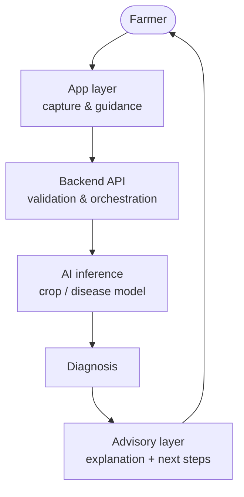

# Architecture

AgriSmart AI is three independent layers behind one farmer-facing experience.

## Layer responsibilities

| Layer   | Owns                                              | Never owns              |
| ------- | ------------------------------------------------- | ----------------------- |
| `app/`  | Image capture, quality feedback, results display  | Model logic or weights  |
| Backend | Request validation, inference calls, advisories   | UI rendering            |
| `model/`| Training, inference, evaluation                   | Farmer-facing wording   |

## Separation rules

1. The app layer sends images, never model code.
2. The model exposes a versioned inference contract (input image → prediction + confidence).
3. Farmer-facing recommendations live in the advisory layer so wording can improve without retraining.
4. Confidence is a first-class output at every stage — uncertain results must be labelled uncertain.

## Status

- **Current:** Layer boundaries and contracts defined on paper.
- **Planned:** App experience, backend API, training/inference pipeline.
- **Future:** Weather, irrigation, sustainability, and IoT integrations (see the main README roadmap).

Further reading: [Product concept](../product/) · [Repository structure](../../README.md#repository-structure)
