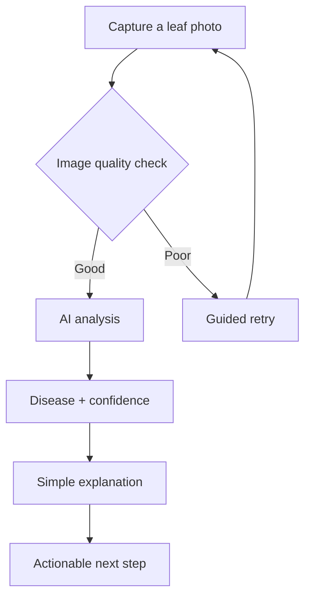

# Product concept

## Target user

A farmer with a smartphone and a sick plant — not a technician. Assume daylight, dusty lenses, patchy connectivity, and zero patience for jargon.

## Farmer journey

## Product principles

1. **Simple interaction.** One clear action per screen; the primary action is always obvious.
2. **Sophisticated technology, invisible complexity.** Confidence, validation, and fallbacks happen quietly.
3. **Farmer-first experience.** Big targets, readable text, plain language, mobile-first.
4. **Honest uncertainty.** "I'm not sure — retake the photo" beats a confident guess.
5. **Recoverable errors.** Every failure state offers a next step, never a dead end.

## Core experience

- Photograph or upload a crop/leaf image.
- Immediate feedback on photo quality (blur, light, framing) with guidance to retake.
- A result stated plainly: what was seen, how confident the system is, what it means.
- One or two practical next steps, plus when to ask an agronomist.
- AgriBot, a contextual assistant, explains results and helps recover from errors — it guides, it never diagnoses on its own.

## Non-goals for the core

Weather forecasting, irrigation scheduling, and crop recommendations are explicitly **future** work — they must not complicate the core diagnosis flow.
